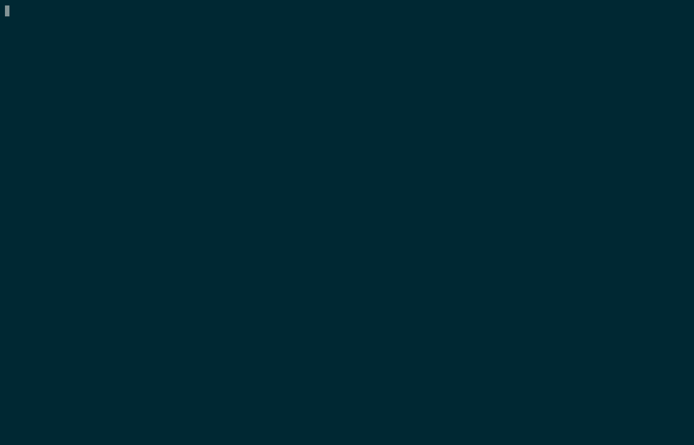
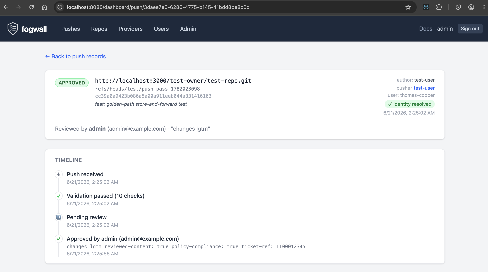
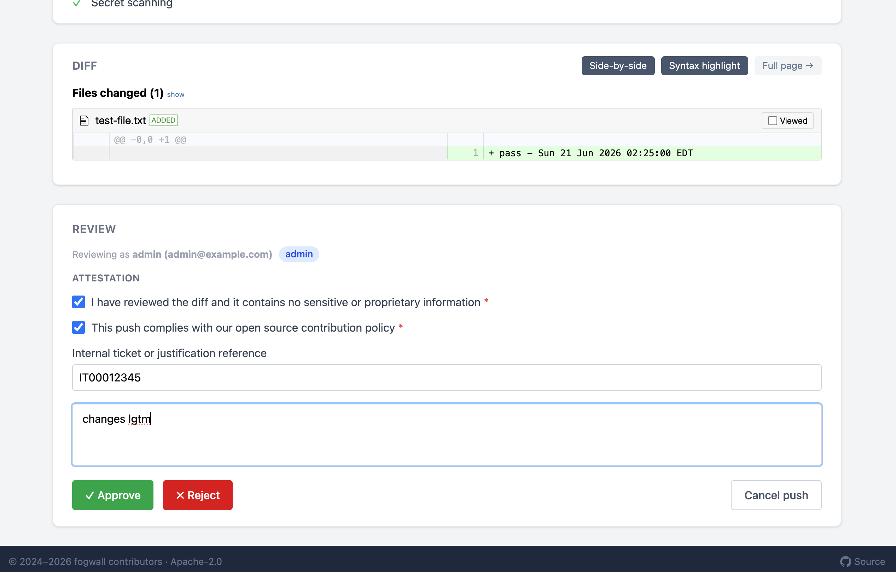

[](https://github.com/RBC/fogwall/actions/workflows/ci.yml)
[](https://github.com/RBC/fogwall/actions/workflows/cve.yml)
[](https://scorecard.dev/viewer/?uri=github.com/RBC/fogwall)
[](https://github.com/RBC/fogwall/blob/main/LICENSE)

# fogwall

A policy-enforcing git push proxy for enterprises. fogwall sits between the developer's `git push` and the upstream host
(GitHub, GitLab, Bitbucket, Forgejo), enforcing commit policies, scanning for secrets, verifying identities, and gating
pushes behind a review workflow — with real-time feedback directly in the developer's terminal.

Built on [JGit](https://github.com/eclipse-jgit/jgit) for native git protocol handling,
[Jetty](https://github.com/jetty/jetty.project) for the HTTP layer, and [Spring](https://spring.io/),
[React](https://react.dev/) & [Tailwind](https://tailwindcss.com/) for the dashboard.



## Validation Features

Both proxy modes enforce the same set of configurable validation rules:

- 🔒 Repository URL allow/deny rules (literal, glob, and regex)
- ✉️ Author email domain allow/block list
- 📝 Commit message validation (literal + regex)
- 🔍 Diff generation and content scanning
- 🔑 Secret scanning ([gitleaks](https://github.com/gitleaks/gitleaks))
- 🪪 SCM identity verification (resolve token → SCM user)
- 🛡️ User push permissions (per-repo RBAC)
- 🕵️ Git history integrity (prevent hidden commits and empty branch pushes)
- ✍️ GPG/SSH commit signature verification
- ✅ Approval gate with configurable mode (auto-approve or manual review via dashboard)
- 📋 Aggregate failure reporting (all errors surfaced at once)
- 📡 Real-time terminal feedback during `git push` as validation runs (store-and-forward)
- 📊 Fetch auditing

## Dashboard





The web dashboard provides push management, approval workflows, and operational tooling:

- 📜 Push lifecycle timeline (received → validated → approved → forwarded)
- ✅ Attestation questionnaire with approve/reject/cancel and audit trail
- 🔓 Self-certify grant for trusted contributors (IdP group-backed)
- 🛡️ Admin override with explicit opt-in and separate audit logging
- 🔒 Allow/deny access rules (literal, glob, regex) scoped by provider and operation
- 👤 Per-user push permissions with the same target/match model as access rules
- 📄 Inline diff viewer with side-by-side toggle; large diffs (>1000 lines) on a dedicated page
- 📦 Repository discovery with push/fetch traffic counts and one-click clone URL
- 🔌 Provider connectivity diagnostics (TCP, TLS, HTTP, git-specific probe)
- 🔄 Live config reload without server restart

## Proxy Modes

Two modes, both active for every provider:

- **Transparent proxy** (`/proxy/<host>/...`) — forwards the push to upstream via Jetty `ProxyServlet`. A servlet filter
  chain validates commits inline and rejects before the push reaches upstream. Developers re-push after fixing any
  validation failures and/or after a push is approved.
- **Store-and-forward** (`/push/<host>/...`) — runs as a live git server to receive the push locally, runs validation
  with real-time terminal feedback, then forwards upstream on approval. The push session stays open while a reviewer
  acts on the dashboard — no need to re-push after approval.

```shell
git remote add proxy http://localhost:8080/push/github.com/owner/repo.git
git push proxy main
```

See the [User Guide](docs/USER_GUIDE.md) for URL scheme details, push modes, and the approval workflow.

## Getting Started

```shell
mise install                       # Java 25 + Node 26 (or install manually)
git clone https://github.com/RBC/fogwall.git && cd fogwall
./gradlew build                    # compile + unit tests
./gradlew :fogwall-dashboard:run   # proxy + dashboard at http://localhost:8080
```

See [CONTRIBUTING.md](CONTRIBUTING.md) for detailed build instructions, Docker Compose setup, test scripts, and
development workflow. See the [Configuration Reference](docs/CONFIGURATION.md) for YAML config, environment variable
overrides, and provider settings.

## Supported Providers

| Provider        | Identity resolution | Notes                                         |
| --------------- | ------------------- | --------------------------------------------- |
| GitHub          | Token → user        | github.com and GitHub Enterprise (custom URI) |
| GitLab          | Token → user        | gitlab.com and self-hosted instances          |
| Bitbucket       | Token → user        | bitbucket.org and Bitbucket Data Center       |
| Forgejo / Gitea | Token → user        | Any Forgejo or Gitea instance                 |

Each provider can be pointed at a self-hosted instance via the `uri` config property. Multiple instances of the same
provider type are supported.

## Authentication

The dashboard supports multiple authentication backends:

| Provider         | Description                                                       |
| ---------------- | ----------------------------------------------------------------- |
| Static (default) | Usernames and password hashes defined in YAML config              |
| LDAP             | Standard LDAP bind + optional group search                        |
| Active Directory | UPN bind via Spring's `ActiveDirectoryLdapAuthenticationProvider` |
| OIDC             | OpenID Connect authorization code flow                            |

See the [Configuration Reference](docs/CONFIGURATION.md#authentication) for setup details. Docker Compose overlays are
provided for [LDAP](docker-compose.ldap.yml) and [OIDC](docker-compose.oidc.yml).

## Push Audit Database

All pushes through the store-and-forward path are recorded as an event log. Each state transition (RECEIVED → APPROVED →
FORWARDED, or BLOCKED/ERROR) is written as a separate row, enabling full push history and audit reporting.

| Type         | Config value | Notes                                      |
| ------------ | ------------ | ------------------------------------------ |
| H2 in-memory | `h2-mem`     | SQL schema, data lost on restart. Default. |
| H2 file      | `h2-file`    | Persistent, zero external dependencies     |
| PostgreSQL   | `postgres`   | Production-grade                           |
| MongoDB      | `mongo`      | Compatible with finos/git-proxy data model |

See the [Configuration Reference](docs/CONFIGURATION.md#database) for connection settings and Docker Compose profiles.

## Project Structure

This is a multi-module Gradle project:

| Module              | Purpose                                                                                    |
| ------------------- | ------------------------------------------------------------------------------------------ |
| `fogwall-core`      | Shared library: filter chain, JGit hooks, push store, provider model, approval abstraction |
| `fogwall-server`    | Standalone proxy-only server — no dashboard, no Spring                                     |
| `fogwall-dashboard` | Dashboard + REST API — Spring MVC, approval UI, depends on `fogwall-server`                |

## Documentation

| Document                                                     | Description                                                                                                      |
| ------------------------------------------------------------ | ---------------------------------------------------------------------------------------------------------------- |
| [User Guide](docs/USER_GUIDE.md)                             | For developers pushing code through the proxy: remote setup, push modes, blocked pushes, approval workflow       |
| [Administrator Guide](docs/ADMIN_GUIDE.md)                   | For operators: RBAC vs permissions, approval modes, logging, JGit filesystem requirements, production checklist  |
| [Configuration Reference](docs/CONFIGURATION.md)             | YAML config structure, environment variable overrides, provider settings, validation rules                       |
| [Architecture](docs/ARCHITECTURE.md)                         | How the proxy works: two proxy modes, validation pipeline, core abstractions, advanced use cases                 |
| [JGit Infrastructure](docs/internals/JGIT_INFRASTRUCTURE.md) | Store-and-forward internals: ReceivePackFactory, hook chain, forwarding, credential flow (contributor reference) |
| [Git Internals](docs/internals/GIT_INTERNALS.md)             | Wire-protocol edge cases: tags, new branches, force pushes, pack parsing (contributor reference)                 |

## Roadmap

The backlog is tracked in [GitHub Issues](https://github.com/RBC/fogwall/issues). The following gists cover design
rationale and reference material:

| Document                                                                                             | Description                                                                                                                        |
| ---------------------------------------------------------------------------------------------------- | ---------------------------------------------------------------------------------------------------------------------------------- |
| [Background & architecture](https://gist.github.com/coopernetes/d02d48efa759282ff8187da0d5dcae64)    | Project background, relationship to finos/git-proxy, store-and-forward vs transparent proxy, near-term and moonshot roadmap        |
| [Programming model comparison](https://gist.github.com/coopernetes/626541b83a148f4ae21ae2c62c57edea) | JGit + Jetty vs Express + child-process git: stack comparison, capability deep-dive, honest assessment of both sides               |
| [Performance benchmarks](perf/)                                                                      | Side-by-side comparison vs finos/git-proxy: sequential and concurrent clone, fetch, push throughput against a shared Gitea backend |

## Acknowledgments

This project would not exist without [FINOS git-proxy](https://github.com/finos/git-proxy) and its contributors, who
designed the original push validation model, approval lifecycle, and multi-provider architecture. The Node.js
implementation remains the reference for the Action/Step pipeline, Sink interface, and filter chain patterns that
fogwall builds on. If you're in a Node.js environment, check out the original.

## Contributing

See [CONTRIBUTING.md](CONTRIBUTING.md) for how to build, run tests, use the manual test scripts in `test/`, and set up
the Docker Compose environment.
