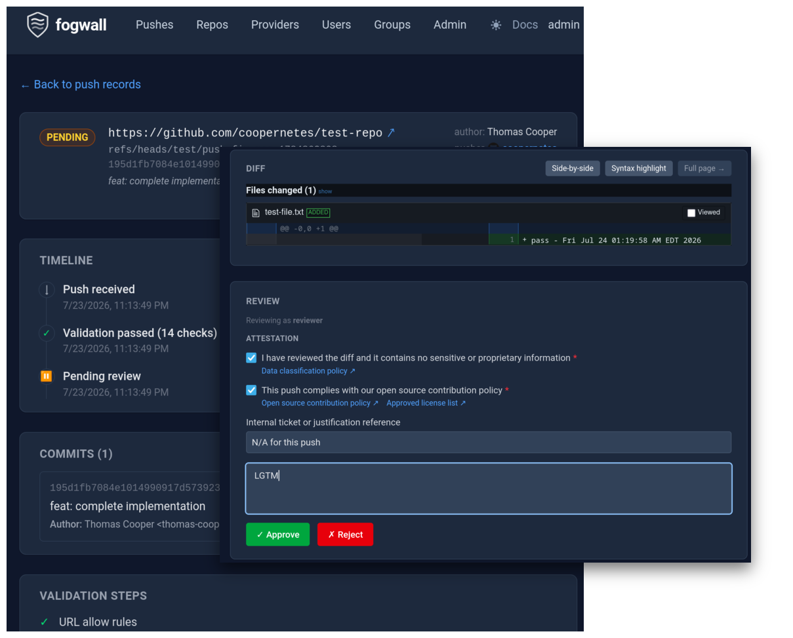

# fogwall

[](https://github.com/RBC/fogwall/releases/latest)
[](https://github.com/RBC/fogwall/pkgs/container/fogwall)
[](https://scorecard.dev/viewer/?uri=github.com/RBC/fogwall)
[](https://github.com/RBC/fogwall/blob/main/LICENSE)

A git-aware gateway that sits between developers and the upstream host (GitHub, GitLab, Bitbucket, Forgejo). Every push
— any branch, any tag — is policy-checked, content-scanned, identity-verified, and gated behind review before it reaches
upstream; every fetch is audited. Feedback streams to the developer's terminal, over HTTP(S) or SSH.

Built on [JGit](https://github.com/eclipse-jgit/jgit) for native git protocol handling,
[Jetty](https://github.com/jetty/jetty.project) for the HTTP layer,
[Apache MINA SSHD](https://mina.apache.org/sshd-project/) for the SSH server, and Spring
([Web](https://docs.spring.io/spring-framework/reference/web/webmvc.html),
[Security](https://spring.io/projects/spring-security)) with [React](https://react.dev/) &
[Tailwind](https://tailwindcss.com/) for the dashboard.


## Getting Started

fogwall is distributed as a container image.

```shell
docker pull ghcr.io/rbc/fogwall:latest
docker run -p 8080:8080 ghcr.io/rbc/fogwall:latest
```

`fogwall` is the dashboard + REST API image; `fogwall-server` is the standalone proxy-only variant (no dashboard, no
Spring) — swap the image name to use it instead.

| Tag       | What it is                                                                            |
| --------- | ------------------------------------------------------------------------------------- |
| `:latest` | The most recent tagged release. Use this unless you have a reason not to.             |
| `:vX.Y.Z` | A specific pinned release.                                                            |
| `:edge`   | Built from `main` on every merge — newer, less battle-tested. Not for production use. |

See the [Configuration Reference](docs/CONFIGURATION.md) for YAML config, environment variable overrides, and provider
settings. If you'd rather build and run from source (or need the Docker Compose dev environment, test scripts, or to
contribute), see [CONTRIBUTING.md](CONTRIBUTING.md).

## Validation Features

Both proxy modes enforce the same set of configurable validation rules:

- 🪪 Identity linkage — internal corporate identity bound to upstream SCM identity, verified on every push (token over
  HTTPS, SSH key fingerprint over SSH)
- 🛡️ Governance per persona — per-repo push permissions (RBAC), self-certify for trusted maintainers, peer review by
  default, or unattended auto-approve on the standalone server
- 🔒 Repository URL allow/deny rules (literal, glob, and regex)
- 🕵️ Git history integrity (prevent hidden commits and empty branch pushes)
- ✍️ GPG commit signature verification
- 🔑 Secret scanning ([gitleaks](https://github.com/gitleaks/gitleaks)); findings redacted at rest
- 🔍 Diff content scanning — custom patterns plus built-in PII bundles (national ID patterns are warning-only)
- 🧊 Binary blob detection by magic-byte signature, with MIME-type allow/deny
- ✉️ Author email domain allow/block list
- 📝 Commit message validation (literal + regex)
- 📊 Fetch auditing

## Dashboard



The web dashboard provides push management, approval workflows, and operational tooling:

- 🔒 Allow/deny URL rules (literal, glob, regex) scoped by provider and operation
- 👤 Per-user and per-group push permissions with the same target/match model as URL rules
- 🛡️ Admin override with explicit opt-in and separate audit logging
- 🧪 Dry-run test endpoints for rules and permissions before rollout
- 📜 Push lifecycle timeline (received → validated → approved → forwarded)
- ✅ Attestation questionnaire (with linkable policy references) and approve/reject/cancel audit trail
- 📄 Inline diff viewer with side-by-side toggle; large diffs (>1000 lines) on a dedicated page
- 📦 Repository discovery with push/fetch traffic counts and one-click clone URL
- 🔌 Provider connectivity diagnostics (TCP, TLS, HTTP, git-specific probe)
- 🔄 Live config reload without server restart

## Supported Providers

| Provider        | Identity resolution | Notes                                         |
| --------------- | ------------------- | --------------------------------------------- |
| GitHub          | Token → user        | github.com and GitHub Enterprise (custom URI) |
| GitLab          | Token → user        | gitlab.com and self-hosted instances          |
| Bitbucket       | Token → user        | bitbucket.org and Bitbucket Data Center       |
| Forgejo / Gitea | Token → user        | Any Forgejo or Gitea instance                 |

Each provider can be pointed at a self-hosted instance via the `uri` config property. Multiple instances of the same
provider type are supported. Pushes over both HTTPS and SSH (opt-in) are supported — see the
[User Guide](docs/USER_GUIDE.md) for choosing a proxy mode and setting up a remote, and the
[Administrator Guide](docs/ADMIN_GUIDE.md#ssh-transport) for SSH setup.

## Authentication

The dashboard supports multiple authentication backends:

| Provider         | Description                                                       |
| ---------------- | ----------------------------------------------------------------- |
| Static (default) | Usernames and password hashes defined in YAML config              |
| LDAP             | Standard LDAP bind + optional group search                        |
| Active Directory | UPN bind via Spring's `ActiveDirectoryLdapAuthenticationProvider` |
| OIDC             | OpenID Connect authorization code flow                            |

LDAP, Active Directory, and OIDC backends can optionally run in open-access mode — any authenticated user gets default
role access when no group/role mapping is configured, rather than being locked out. See the
[Configuration Reference](docs/CONFIGURATION.md#authentication) for setup details. Docker Compose overlays are provided
for [LDAP](docker/docker-compose.ldap.yml) and [OIDC](docker/docker-compose.oidc.yml).

## Deployment

- [Outbound corporate proxy](docs/CONFIGURATION.md#outbound-proxy) support (Basic and Kerberos auth)
- [Custom upstream CA trust](docs/CONFIGURATION.md#custom-upstream-ca-trust); optional
  [HTTPS listener](docs/CONFIGURATION.md#server-https-listener)
- [Helm chart](charts/fogwall/README.md), including L4 passthrough for the SSH listener
- [Redis-backed sessions](docs/CONFIGURATION.md#session-persistence-for-multi-instance-deployments) for multi-replica
  dashboards

See the full [Configuration Reference](docs/CONFIGURATION.md) and [Administrator Guide](docs/ADMIN_GUIDE.md).

## Push Audit Database

All pushes through the store-and-forward path are recorded as an event log. Each state transition (RECEIVED → APPROVED →
FORWARDED, or BLOCKED/ERROR) is written as a separate row, enabling full push history and audit reporting.

| Type         | Config value | Notes                                      |
| ------------ | ------------ | ------------------------------------------ |
| H2 in-memory | `h2-mem`     | SQL schema, data lost on restart. Default. |
| H2 file      | `h2-file`    | Persistent, zero external dependencies     |
| PostgreSQL   | `postgres`   | Production-grade                           |
| MySQL        | `mysql`      | MySQL 8.0+                                 |
| MariaDB      | `mariadb`    | MariaDB 10.5+                              |
| MongoDB      | `mongo`      | —                                          |

See the [Configuration Reference](docs/CONFIGURATION.md#database) for connection settings and Docker Compose profiles.

## Documentation

| Document                                                     | Description                                                                                                      |
| ------------------------------------------------------------ | ---------------------------------------------------------------------------------------------------------------- |
| [User Guide](docs/USER_GUIDE.md)                             | For developers pushing code through the proxy: remote setup, push modes, blocked pushes, approval workflow       |
| [Administrator Guide](docs/ADMIN_GUIDE.md)                   | For operators: RBAC vs permissions, approval modes, logging, JGit filesystem requirements, production checklist  |
| [Configuration Reference](docs/CONFIGURATION.md)             | YAML config structure, environment variable overrides, provider settings, validation rules                       |
| [Architecture](docs/ARCHITECTURE.md)                         | How the proxy works: two proxy modes, validation pipeline, core abstractions, advanced use cases                 |
| [JGit Infrastructure](docs/internals/JGIT_INFRASTRUCTURE.md) | Store-and-forward internals: ReceivePackFactory, hook chain, forwarding, credential flow (contributor reference) |
| [Git Internals](docs/internals/GIT_INTERNALS.md)             | Wire-protocol edge cases: tags, new branches, force pushes, pack parsing (contributor reference)                 |

## Roadmap

The backlog is tracked in [GitHub Issues](https://github.com/RBC/fogwall/issues). The following gists cover design
rationale and reference material:

| Document                                                                                             | Description                                                                                                                        |
| ---------------------------------------------------------------------------------------------------- | ---------------------------------------------------------------------------------------------------------------------------------- |
| [Background & architecture](https://gist.github.com/coopernetes/d02d48efa759282ff8187da0d5dcae64)    | Project background, relationship to finos/git-proxy, store-and-forward vs transparent proxy, near-term and moonshot roadmap        |
| [Programming model comparison](https://gist.github.com/coopernetes/626541b83a148f4ae21ae2c62c57edea) | JGit + Jetty vs Express + child-process git: stack comparison, capability deep-dive, honest assessment of both sides               |
| [Performance benchmarks](perf/)                                                                      | Side-by-side comparison vs finos/git-proxy: sequential and concurrent clone, fetch, push throughput against a shared Gitea backend |

## Acknowledgments

This project would not exist without [FINOS git-proxy](https://github.com/finos/git-proxy) and its contributors, who
designed the original push validation model, approval lifecycle, and multi-provider architecture. The Node.js
implementation remains the reference for the Action/Step pipeline, Sink interface, and filter chain patterns that
fogwall builds on. If you're in a Node.js environment, check out the original.

## Contributing

See [CONTRIBUTING.md](CONTRIBUTING.md) for how to build, run tests, use the manual test scripts in `test/`, and set up
the Docker Compose environment.
