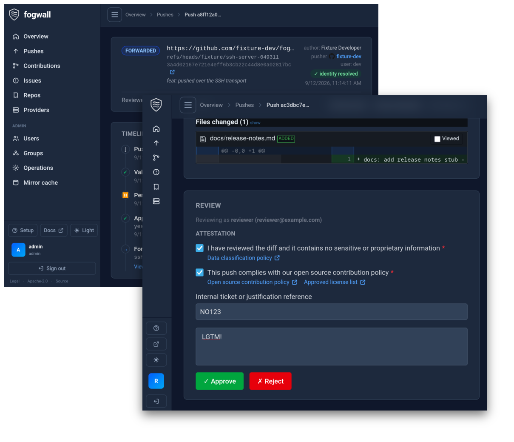

# fogwall

[](https://github.com/RBC/fogwall/releases/latest)
[](https://github.com/RBC/fogwall/pkgs/container/fogwall)
[](https://scorecard.dev/viewer/?uri=github.com/RBC/fogwall)
[](https://github.com/RBC/fogwall/blob/main/LICENSE)
[](https://rbc.github.io/fogwall/)

A git-aware gateway that sits between developers and the upstream host (GitHub, GitLab, Bitbucket, Forgejo). Every push
— any branch, any tag — is policy-checked, content-scanned, identity-verified, and gated behind review before it reaches
upstream; every fetch is audited. Feedback streams to the developer's terminal, over HTTP(S) or SSH.

Built on [JGit](https://github.com/eclipse-jgit/jgit) for native git protocol handling,
[Jetty](https://github.com/jetty/jetty.project) for the HTTP layer,
[Apache MINA SSHD](https://mina.apache.org/sshd-project/) for the SSH server, and Spring
([Web](https://docs.spring.io/spring-framework/reference/web/webmvc.html),
[Security](https://spring.io/projects/spring-security)) with [React](https://react.dev/) &
[Tailwind](https://tailwindcss.com/) for the dashboard.

**📚 Documentation — <https://rbc.github.io/fogwall/>**


## Getting Started

fogwall is distributed as a container image.

```shell
docker pull ghcr.io/rbc/fogwall:latest
docker run -p 8080:8080 ghcr.io/rbc/fogwall:latest
```

`fogwall` is the dashboard + REST API image; `fogwall-server` is the standalone proxy-only variant (no dashboard, no
Spring) — swap the image name to use it instead.

| Tag       | What it is                                                                            |
| --------- | ------------------------------------------------------------------------------------- |
| `:latest` | The most recent tagged release. Use this unless you have a reason not to.             |
| `:vX.Y.Z` | A specific pinned release.                                                            |
| `:edge`   | Built from `main` on every merge — newer, less battle-tested. Not for production use. |

For Kubernetes, there is a [Helm chart](charts/fogwall/README.md). If you'd rather build and run from source (or need
the Docker Compose dev environment, test scripts, or to contribute), see [CONTRIBUTING.md](CONTRIBUTING.md).

## Features

### Policy

Both proxy modes enforce the same rules:

- 🔀 **Proxy push and fetch over HTTPS and SSH** — branches and tags alike, as a transparent proxy or as a
  receive-validate-forward server
- 🪪 **Link public SCM accounts** (GitHub, GitLab, …) **to internal corporate identities**, checked on every push
- 🛡️ **One permission model across every upstream**, whoever hosts the repo
- 🔍 **Diff and commit message scanning** — custom patterns plus built-in PII bundles
- 🔑 **Secret scanning** ([gitleaks](https://github.com/gitleaks/gitleaks)); findings redacted at rest
- 💬 **Proxy the SCM CLIs** (`gh`, `glab`, `tea`, `fj`) — outbound PR/MR and comment content, inspected the same way
- 🧊 **Binary blob detection** by magic-byte signature, with MIME-type allow/deny
- ✍️ **GPG commit signature verification**
- 📝 **Commit attribution policy** — author, committer, `Co-authored-by` and DCO trailers, against allowed email domains
- 🔒 **Proxy-wide URL allow/deny rules**
- 🕵️ **Git-level guards** — rejects hidden commits, empty branch pushes, Git LFS and push options
- 📊 **Audit trail** — every push state transition and every fetch recorded, in both modes

### Dashboard



Push management and approval, URL rules and per-user permissions, a lifecycle timeline with an inline diff viewer,
provider connectivity diagnostics, and live config reload.

## Supported Providers

Three public hosts are enabled out of the box; Gitea and Bitbucket ship configured but switched off. Pinned SSH host
keys are included for every built-in host either way.

| Provider      | Default upstream            | Out of the box         | Transports | Also works with                 |
| ------------- | --------------------------- | ---------------------- | ---------- | ------------------------------- |
| GitHub        | `github.com`                | Enabled                | HTTPS, SSH | GitHub Enterprise               |
| GitLab        | `gitlab.com`                | Enabled                | HTTPS, SSH | Self-hosted instances           |
| Forgejo       | `codeberg.org`, `gitea.com` | Codeberg on, Gitea off | HTTPS, SSH | Any Forgejo or Gitea instance   |
| Bitbucket     | `bitbucket.org`             | Built in, off          | HTTPS      | Bitbucket Data Center           |
| Anything else | —                           | `type: generic`        | HTTPS      | Anything speaking git over HTTP |

Generic git servers do not support every feature — see
[Providers](https://rbc.github.io/fogwall/configuration/providers.html) for details.

## Documentation

Everything lives at **<https://rbc.github.io/fogwall/>**.

| Section                                                                 | For                                                                 |
| ----------------------------------------------------------------------- | ------------------------------------------------------------------- |
| [User Guide](https://rbc.github.io/fogwall/user/)                       | Developers pushing through the proxy                                |
| [Administrator Guide](https://rbc.github.io/fogwall/admin/)             | Operators deploying, configuring and running it                     |
| [Configuration Reference](https://rbc.github.io/fogwall/configuration/) | Every YAML key, what it does, what it defaults to                   |
| [Architecture](https://rbc.github.io/fogwall/architecture/)             | Contributors: modules, proxy modes, request flow, core abstractions |
| [Internals](https://rbc.github.io/fogwall/internals/)                   | Contributor notes on git, JGit and SCM API behaviour                |

## Roadmap

The backlog is tracked in [GitHub Issues](https://github.com/RBC/fogwall/issues). The following gists cover design
rationale and reference material:

| Document                                                                                             | Description                                                                                                                        |
| ---------------------------------------------------------------------------------------------------- | ---------------------------------------------------------------------------------------------------------------------------------- |
| [Background & architecture](https://gist.github.com/coopernetes/d02d48efa759282ff8187da0d5dcae64)    | Project background, relationship to finos/git-proxy, server mode vs transparent proxy, near-term and moonshot roadmap              |
| [Programming model comparison](https://gist.github.com/coopernetes/626541b83a148f4ae21ae2c62c57edea) | JGit + Jetty vs Express + child-process git: stack comparison, capability deep-dive, honest assessment of both sides               |
| [Performance benchmarks](perf/)                                                                      | Side-by-side comparison vs finos/git-proxy: sequential and concurrent clone, fetch, push throughput against a shared Gitea backend |

## Acknowledgments

This project would not exist without [FINOS git-proxy](https://github.com/finos/git-proxy) and its contributors, who
designed the original push validation model, approval lifecycle, and multi-provider architecture. The Node.js
implementation remains the reference for the Action/Step pipeline, Sink interface, and filter chain patterns that
fogwall builds on. If you're in a Node.js environment, check out the original.

## Contributing

See [CONTRIBUTING.md](CONTRIBUTING.md) for how to build, run tests, use the manual test scripts in `test/`, and set up
the Docker Compose environment.
